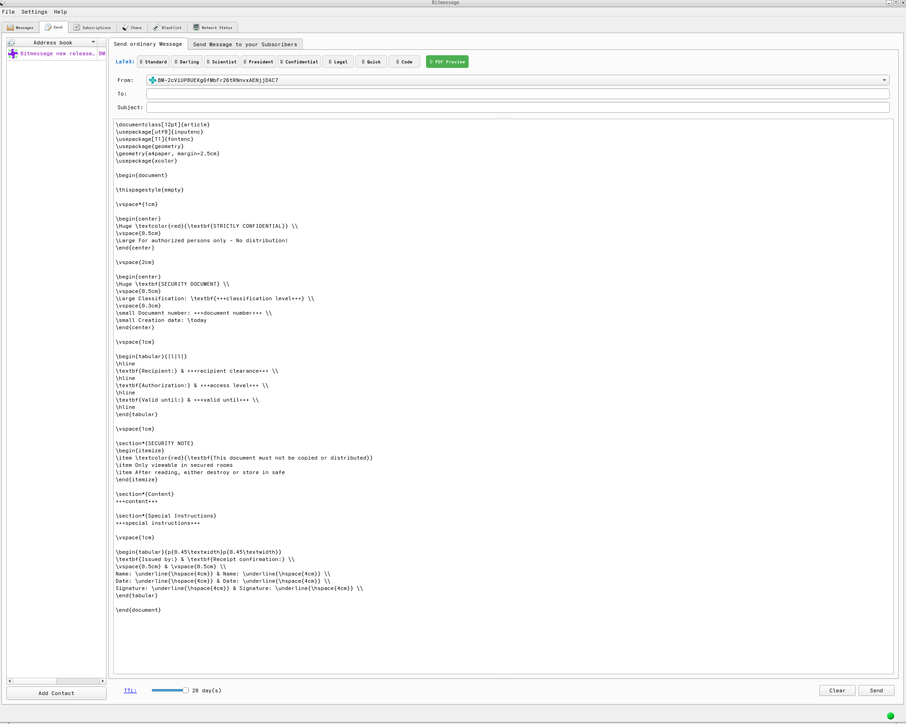

## LaTeX bridge with hardened protocol - whitelisted LaTeX, and json instead of pickle to prevent possible code injection execution.
## other languages may fail.

## LaTeX bridge based on pybitmessage
pip3 install -r requirements.txt  
python3 setup.py build  
python3 setup.py install  
sh py3start.sh  
## libressl 4.1.0 pre-compiled support - no binary blobs
cd /home  
sh libressl.sh  
-> /home/libressl-4.1.0/build/ssl/libssl.so  
-> /home/libressl-4.1.0/build/crypto/libcrypto.so  
  
## source
https://github.com/kashikoibumi/PyBitmessage.git  
https://github.com/jon1enforce/DEBUG_pybitmessage.git  
https://codeberg.org/jon1enforce/LaTeX_bridge
## preview
  

